# How to run Medusa on Gitpod

## Introduction

In this tutorial, you will learn how to install, run and test Medusa on Gitpod.

### What is Medusa?

[Medusa](https://docs.medusajs.com/development/overview) is an open source composable commerce engine for building ecommerce websites. A great alternative to Shopify with much more features.

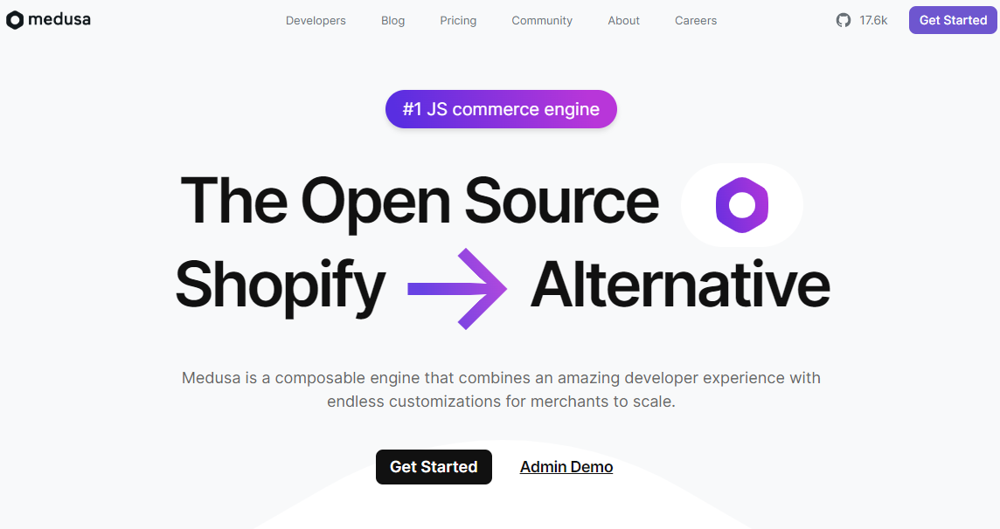

It was built using Express running onn Node.js.

It is fully customizable and extensible throught the use of commerce modules. You can build webshops, subscription services, digital products stores, ticketing systems, and any other ecommerce solutions.

Here is an architecture example of a full fledged ecommere app you can build using Medusa.


You could think of Medusa as a set of tools used to build digital commerce applications. If you want to know more about Medusa, check out their [documentation](https://docs.medusajs.com).

### What is Gitpod?

[Gitpod](https://www.gitpod.io/docs/introduction/getting-started) is a cloud development environment. It allows developers to code and collaborate on projects in a browser-based workspace. You can code on the go with any device as long as there is internet access and a web browser.

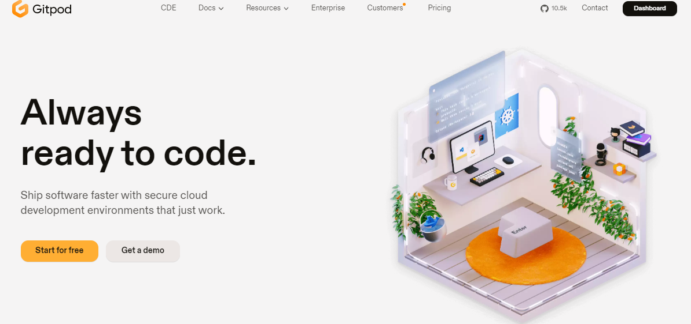

It uses a Linux-based container in the cloud, with code editor/ide of your choice. You can spin up a fresh dev environment within seconds. It comes with most commonly used developer tools especially for web developers.

Personally, I use Gitpod to test open source apps built by other developers, new technologies and small projects. It can be very convenient if you are limited on compute power on your local machine.

### Objective of tutorial

This tutorial will show you how to install, run and test a Medusa based project in a Gitpod workspace. We will use the default quickstart Next.js storefront provided by Medusa as means to test the project. You will walk through the steps required to configure Gitpod to work with Medusa. By the end of this tutorial, you should have a working Medusa app running in your Gitpod workspace.

## Prerequisites

To follow along this tutorial you must have the following:

- Gitpod account: [Sign up here](https://gitpod.io)
> **NOTE:**
>
>You must have anyone of the following accounts to sign up for Gitpod:
>- GitHub
>- GitLab
>- Bitbucket
- Web browser of your choice
- SSH client of your choice

## Step 1 - Initialize Gitpod Workspace

[Log in to your Gitpod account](https://gitpod.io/).
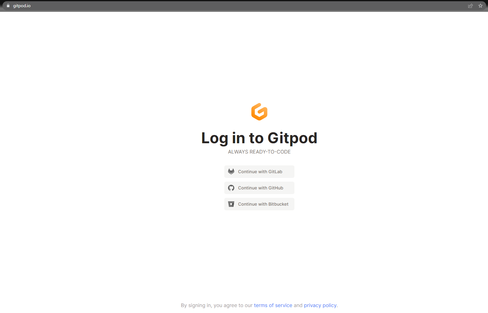

Start a new workspace by clicking on `New Workspace` or pressing `Ctrl + O` on your keyboard.

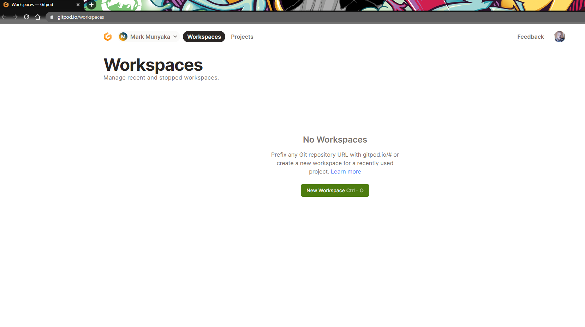

Select a repository from your GitHub/GitLab/Bitbucket account and leave the `Editor` and `Class` options with the default values and click on `New Workspace`.

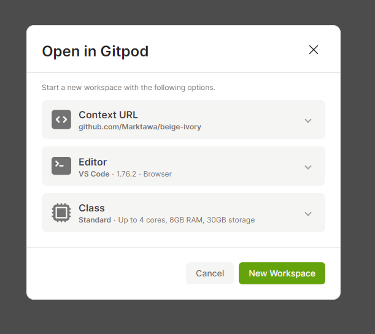

You should see VSCode in your browser, with a list of the files in your repository in the `EXPLORER`. This is your Gitpod workspace running.

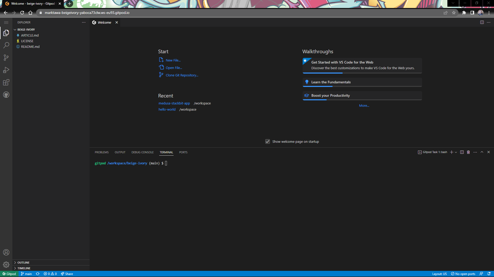

## Step 2 - Setup Medusa backend

Next, you will install Medusa backend using the [Quickstart guide](https://docs.medusajs.com/development/backend/install).

The default Gitpod workspace comes pre-installed with `node`, `npm` and `yarn`. These are the necessary tools required to install Medusa.

In the terminal window, install the Medusa CLI.
```bash
npm install @medusajs/medusa-cli -g
```

Create a new Medusa project for your backend and seed it with some data.
```bash
medusa new my-medusa-store --seed
```

Start your Medusa backend server
```bash
cd my-medusa-store
medusa develop
```

Your Medusa server should start running on port 9000. Test it, in a new terminal tab.
```bash
curl localhost:9000/store/products
```

The beginning of the JSON response should be similar to this:
```json
{
    "products": [
        {
            "id": "prod_01GWTHY98VZ3BHWFJX9DNXJ6PY",
            "title": "Medusa Coffee Mug",
            "subtitle": null,
            "status": "published",
            "external_id": null,
            "description": "Every programmer's best friend.",
            "handle": "coffee-mug",
            "is_giftcard": false,
            "discountable": true,
            "thumbnail": "https://medusa-public-images.s3.eu-west-1.amazonaws.com/coffee-mug.png",
            "profile_id": "sp_01GWTHY89ZKN791N6H948SVA38",
            "collection_id": null,
            "type_id": null,
            "weight": 400,
            "length": null,
            "height": null,
            "width": null,
            "hs_code": null,
            "origin_country": null,
            "mid_code": null,
            "material": null,
```

## Step 3 - Setup Next.js storefront

Next you will install the Next.js starter storefront to view the products from the server using the [Next.js Storefront Quickstart Guide](https://docs.medusajs.com/starters/nextjs-medusa-starter) in the Medusa Documentation.

In a new terminal tab, create a new Next.js project using the Medusa starter template:

```bash
npx create-next-app -e https://github.com/medusajs/nextjs-starter-medusa my-medusa-storefront
```

Set up environment variables for your Next.js storefront:

```bash
cd my-medusa-storefront
mv .env.template .env.local
```

Make sure the Medusa backend server is running and then run the Next.js app:

```bash
npm run dev
```

Your Next.js storefront should start running on port 8000.

Gitpod will automatically create a preview link based on the port which is running. If you don't see it click on the `PORTS` tab and should see a list of ports available for preview. Select the preview link for port `8000`.

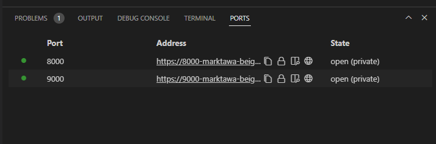

A new tab with the URL of the preview link to the storefront will open. Here's the storefront.

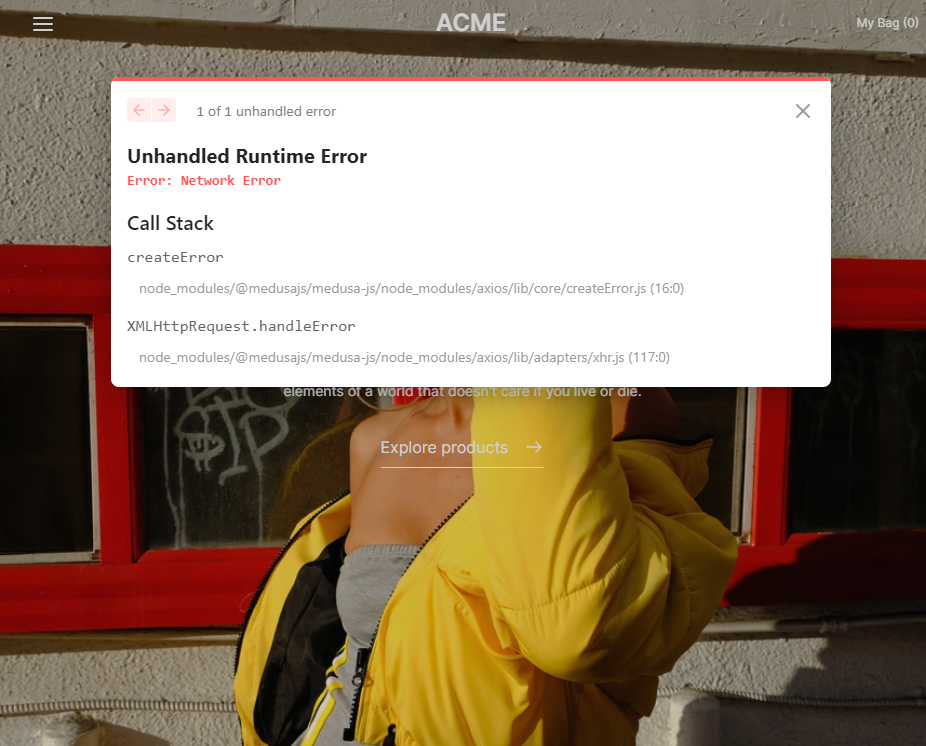

The storefront loads but the products from the backend server do not appear. This is due to a Network Error due to some CORS issue.

To get around this we will use port forwarding to preview the storefront.

## Step 4 - Setup SSH port forwarding

In this step we will use SSH port forwarding to preview the storefront in your browser. If you want to know more about SSH port forwarding please check out this [article](https://www.ssh.com/academy/ssh/tunneling-example).

Make sure you have an SSH client installed on your computer before you proceed with this step. I used OpenSSH, but the instructions work for other SSH clients too.

In a new browser tab, go to your Gitpod Workspaces Dashboard. Click on the Actions icon for your Medusa project workspace. Select `Connect via SSH`.

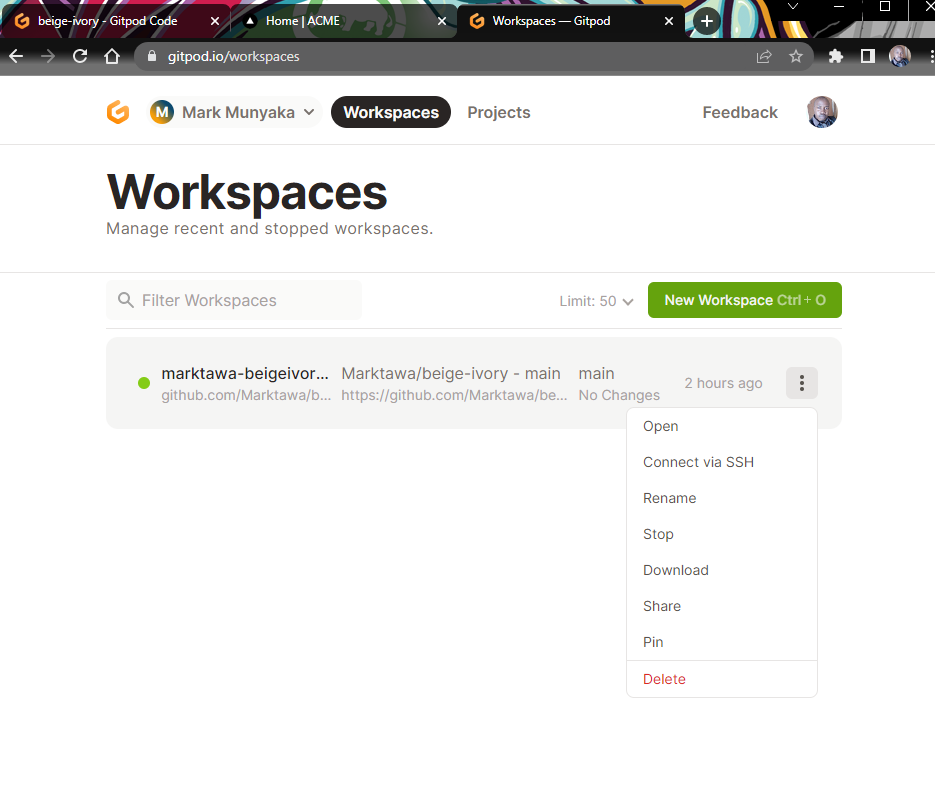

In the `Connect via SSH` modal select the `Access Token` tab and copy the link given.

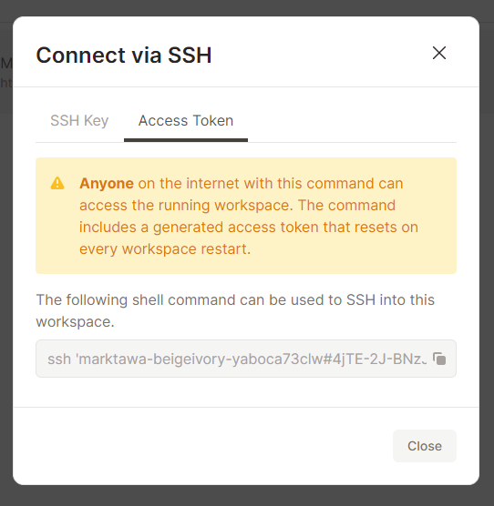

In a terminal application on your local computer paste the link for your SSH Access token and edit the command to forward port 9000 using SSH.

```bash
ssh -L 9000:localhost:9000 marktawa-beigeivory-yaboca73clw#4jTE-2J-BNzJpS48OOaP0deLZsANtY-L@marktawa-beigeivory-yaboca73clw.ssh.ws-eu93.gitpod.io
```

Replace the link *marktawa-beig...* with the specific link for your workspace.

If all works well port 9000 from the remote Gitpod workspace should be available on your local machine you can test using `curl localhost:9000/store/products` and you should see the list of products.

Next forward port 8000 for the storefront. Copy the previous command and replace 9000 with 8000.

```bash
ssh -L 8000:localhost:8000 marktawa-beigeivory-yaboca73clw#4jTE-2J-BNzJpS48OOaP0deLZsANtY-L@marktawa-beigeivory-yaboca73clw.ssh.ws-eu93.gitpod.io
```

Step 5 - Preview Next.js Starter Storefront

Open a new tab and go to `localhost:8000` in your browser. You should see the Next.js starter storefront once again. 

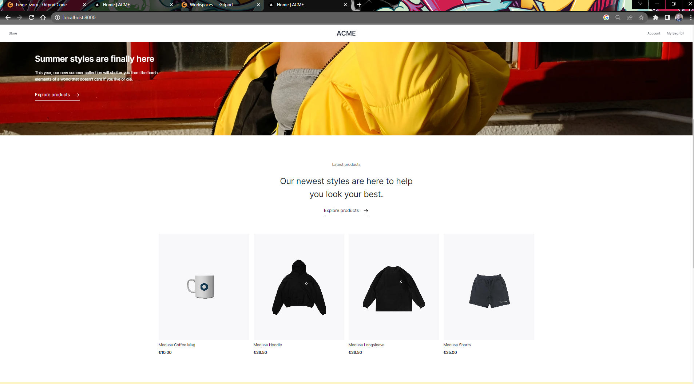

The difference now is that the products load and there is no network error. With that done, you have successfully run and tested your storefront.

## Conclusion

Congratulations! You have successfull set up a Medusa backend with a Next.js storefront on an online development environment provided by Gitpod.

You also learned how to use SSH port forwarding to preview the storefront without any network errors.

This tutorial has helped you gain a solid understanding of how to use Medusa and Gitpod to build ecommerce applications efficiently. You can now continue to customize and build upon this foundation to create an e-commerce application that meets your specific needs. Keep exploring and have fun building!

### Useful Links

- [Medusa Documentation](https://docs.medusajs.com)
- [Gitpod Documentation](https://www.gitpod.io/docs/introduction)
- [Next.js Documentation](https://nextjs.org/docs/getting-started)
- [SSH Resource](https://www.ssh.com/academy/ssh)